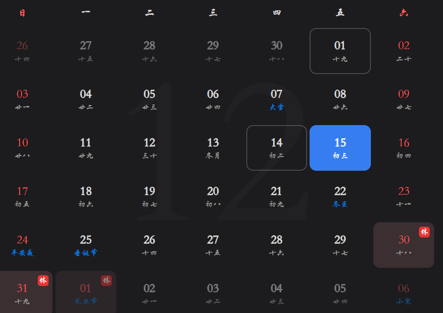

- [ ] 填写表格
	- [ ] 公积金那一栏怎么填写

- [ ] 绘制三个按键的板子
	- [x] 原理图
	- [ ] PCB图
问题 :   
- [ ] 这个板子原来的结构是什么样子的?
	- [ ] 应该是直接接的5V电压到手控盒子上
	- [ ] 那么现在29V的电机控制芯片的29V应该从哪儿接?

- [ ] Buck升压电路
- [ ] Labview
	- [ ] 先写出一个简单串口通讯程序
___  
- [ ] 问一下如何更改电机的线
___
# 上班的时间问题
- [ ] 目前暂时确定25号可以去上班
	- [ ] 