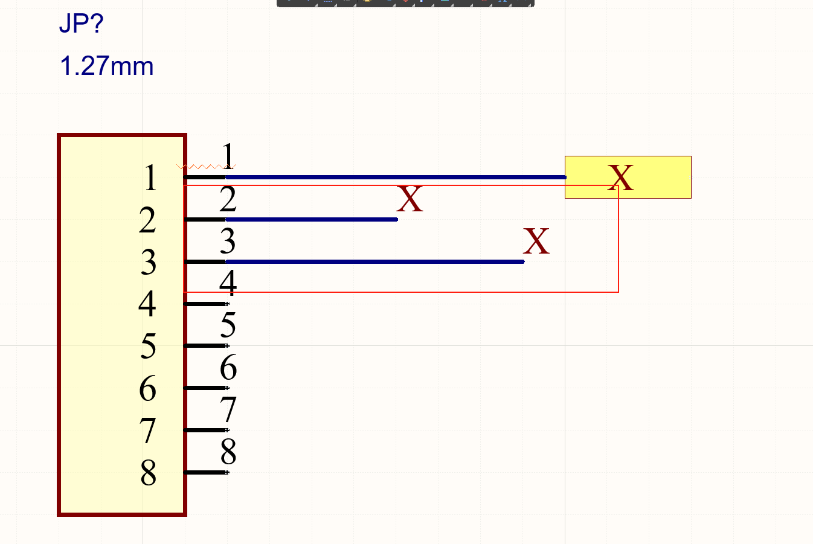
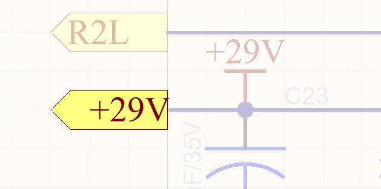
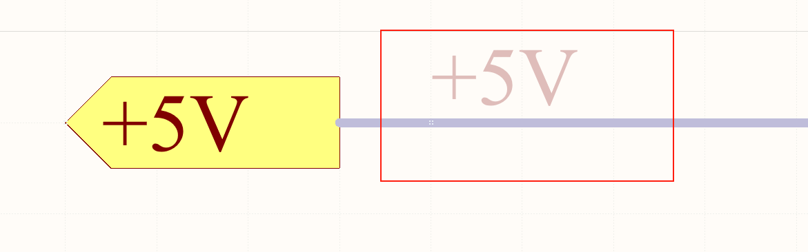
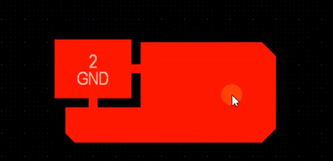
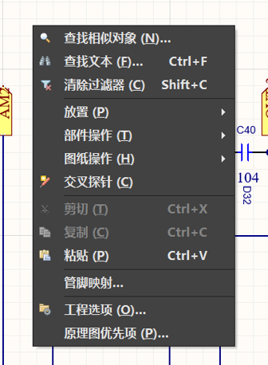

# Design Item ID 与Design的区别

[Design Item ID 与Design的区别](https://blog.csdn.net/qq_38113006/article/details/109827293#:~:text=%E9%A6%96%E5%85%88%EF%BC%8C%E3%80%90Design%20Item,ID%E3%80%91%E6%88%91%E4%BB%AC%E4%B8%80%E8%88%AC%E4%BC%9A%E5%A1%AB%E5%86%99%E8%BF%99%E4%B8%AA%E5%99%A8%E4%BB%B6%E7%9A%84%E5%90%8D%E7%A7%B0%EF%BC%8C%E8%BF%99%E6%98%AF%E4%B8%AD%E5%9B%BD%E5%99%A8%E4%BB%B6%E5%9C%A8%E8%BF%99%E4%B8%AA%E5%8E%9F%E7%90%86%E5%9B%BE%E5%BA%93%E7%9A%84%E5%94%AF%E4%B8%80%E6%A0%87%E8%AF%86%E7%AC%A6%E3%80%82%20%E7%84%B6%E5%90%8E%E6%98%AF%E3%80%90Designator%E3%80%91%EF%BC%8C%E6%98%AF%E5%99%A8%E4%BB%B6%E7%9A%84%E4%BD%8D%E5%8F%B7%EF%BC%8C%E8%BF%99%E4%B8%AA%E6%98%AF%E4%B8%80%E5%AE%9A%E8%A6%81%E6%9C%89%E7%9A%84%EF%BC%8C%E7%94%A8%E6%9D%A5%E5%9C%A8%E5%8E%9F%E7%90%86%E5%9B%BE%E4%B8%AD%E5%AE%9A%E4%BD%8D%E8%BF%99%E4%B8%AA%E5%99%A8%E4%BB%B6%E3%80%82)

首先，【Design Item ID】我们一般会填写这个器件的名称，这是中国器件在这个原理图库的唯一标识符。    

然后是【Designator】，是器件的位号，这个是一定要有的，用来在原理图中定位这个器件。   

接下来是【Comment】，填写元器件的注释，一般来说，我们可以将元器件的Value值填写在里面。    

最后是【Description】，填写器件的描述，比如这个器件是什么作用，是什么器件，是什么封装的等等。

# 栅格的作用

视图 - > 栅格 -> 设置捕捉栅格  -> 改小栅格    
作用 : 可以让我们绘制的线不在栅格上  

想画线,系统总是帮你自动对齐.这个时候你可以让栅格变小这个时候你就可以画到之前画不到的地方. 在画好之后建议把栅格再调整回去.

# 网络标签 与 端口号 的区别
#仍然存在疑问  

[Altium中网络标签、端口、离图以及编译范围的设置区别\_ad如何将两个原理图的网络端口关联-CSDN博客](https://blog.csdn.net/hzbhao/article/details/120292391)  

将两个原理图的网络端口关联  
（1）网络标签：网络标号，在单张图纸内，它们可以代替导线来表示元件之间的连接：在多张图纸设计中，其功能未变，只能表示单张图纸内部的连接。执行菜单命令“放置-网络标签可以放置。  
（2）端口：端口，既可以表示单张图纸内部的网络连接，也可以表示<mark style="background: #BBFABBA6;">图纸页与图纸页间的网络连接</mark>，常见于层次原理图设计中。执行菜单命令“放置-电源端口”可以放置。  
（3）离图连接器：跨图纸接口，用于不同原理图页之间的电气连接，可以把连接的电气属性扩大到整个工程。执行菜单命令“放置-离图连接器可以放置。  

#网络标签与端口号的名字相同,他们的网络会连接在一起吗?    
如图 :    

     

    

这个会在一起吗? 这两个端子的网络号是一样的,但是使用的端子不一样,那么这两端最终会连接在一起吗?    

经过检测 :    

答案是 : 不会连接在一起,所以需要使用如下的方式来解决这个问题.

看到了吗? 所有的+29V端口都用网络标签与29V连在了一起.

这三个都不算是连接在了一起.要想链接在一起必须每一个都使用其他的相互就如上面的+29V的图.
# 红色波浪线错误
有时候出现这个错误并不要紧,主要要看messages中的error有没有指向这个错误.

另外只要不影响布线,有些错误是可以忽略的.

# 导入DWG文件
[【Altium Designer】使用CAD绘制PCB版型并将dwg文件导入AD(异形板设计)](https://blog.csdn.net/ReadAir/article/details/102561869)  

# 覆铜的问题

# 什么是扇孔
通俗的理解就是拉线打孔  

[什么是PCB扇孔，PCB设计中对PCB扇孔有哪些要求？ - 凡亿教育的文章 - 知乎](https://zhuanlan.zhihu.com/p/645479634)  

# PCB板如何绘制安装孔
[AD软件PCB板中如何画安装孔？](https://zhuanlan.zhihu.com/p/285362761)   

# 如何消除高亮

查找相似对象之后,在sch中会高亮显示查找到的元器件.  
使用清除过滤器可以消除高亮  