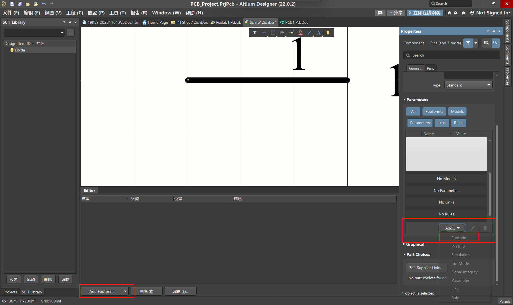
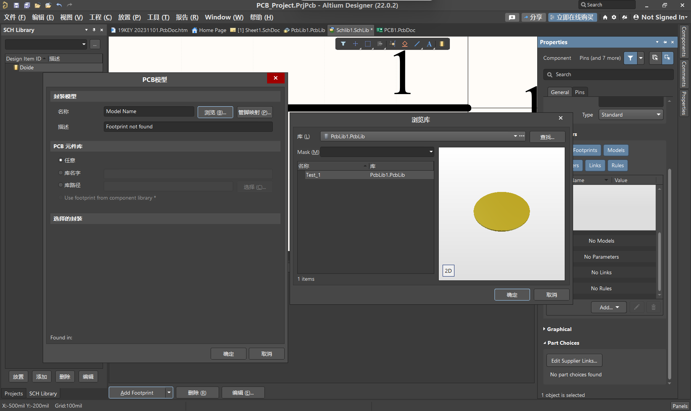
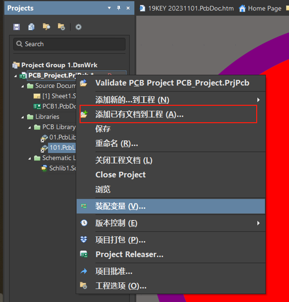

# 参考文章
[CSDN博客有全面的AD教程](https://blog.csdn.net/qq_24213087/article/details/111936819?spm=1001.2014.3001.5502)

# 创建元器件库
1. 原理图库
2. 封装库
这两个是不一样的

# 添加元器件封装

选中原理图,然后在选择封装即可.

选择合适的封装,管教映射亦在其中.

# 添加元器件库

选择原理图库或者PCB库添加进去