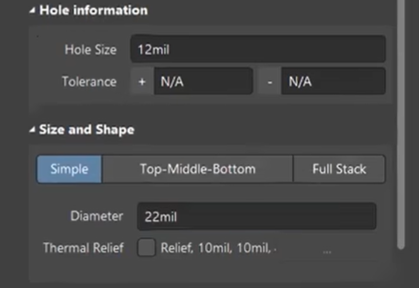

[Altium Design 4层板设计 11小时速成](https://www.bilibili.com/video/BV16t411N7RD?p=27&spm_id_from=pageDriver&vd_source=2f6e531d9d833ca7fdcd8c5bb99bd1bb)  

#第一课  
介绍他们自己的网站,以及一些学习资源  
PCB联盟网 : 一个专注于PCB的论坛   
里面包含一些常见的PCB问题等等

#第4课
# 绘制PCB工作流程

#第五课
# 管脚一定要完全一致
元件符号是元件在原理图上的表现形式，主要由元件边框、管脚（包括管脚序号和管脚名称）、元件名称及元件说明组成，通过放置的管脚来建立电气连接关系。元件符号中的管脚序号是和电子元件实物的管脚一一一对应的。<mark style="background: #FFB86CA6;">在创建元件的时候，图形不一定和实物完全一样，但是对于管脚序号和名称，一定要严格按照元件规格书中的说明一一对应好。</mark>

# 管脚末端的形状设置

# 设置栅格
视图 - > 栅格 -> 设置捕捉栅格  -> 改小栅格    
作用 : 可以让我们绘制的线不在栅格上  

#第七课
# 阵列式粘贴
选中元器件 -> ctrl+c -> 编辑 - > 阵列式粘贴  

主增量 : 这个可以设置管教是 1 2 3 4 5 6还是 1 3 5 7 9 ;  

#第八课   

# 栅格的作用

想画线,系统总是帮你自动对齐.这个时候你可以让栅格变小这个时候你就可以画到之前画不到的地方. 在画好之后建议把栅格再调整回去.  

#第九课   

# 使用已有原理图生成原理图库
设计 - > 生成原理图库  

#第11课  
器件的复制与对齐

# 使用方框将原理图模块化

注意要使用线而不是导线  
右击空白处 - > 放置 - > 绘图工具 - > 线 L  

#第12课
导线的绘制与netlabel的放置   

# Netlable
netlabel ; 选中导线 - > 右击 - > 放置 - > 网络标签

#第13课 
value值的核对

# 元器件的编号
一般是先连接电路,在电路连接完之后再标注电元器件的编号.    
工具 - 标注 - 原理图标注  
  

注意点 :   
1. 勾选需要标注的原理图页面
2. 先reset all - 更新更改列表

#第14课
封装的统一管理

# 统一改变许多元器件的封装

工具 - 封装管理器 - 选中要更改的元器件 - 编辑 - 选中封装 - 接受变更 - 执行变更

#第15课 
原理图的编译与检查  
工程 - 工程选项   

右击原理图 - 编译 - 错误显示出来  
右下角 - panel - 左击 - 选中 - messages

#第16课
#绘制PCB封装库技巧
    

# 焊盘的分类
  
就在表面的焊盘 (top layer)

  
multi layer 多个层

# 如何精确移动焊盘
选中焊盘 - 按下按键m - 选择通过xy平移 - 输入10mm - 精确移动10mm

# 镜像
选中焊盘 +  ctrl+c + 再选中一个点 - 就是渎职了一个焊盘相对于这个点的位置  
x y 镜像翻转  

#第17课  
常见IC类的封装  

#第18课  
利用ipc封装创建向快速创建封装  
# 使用IPC创建3D元件

工具 - IPC第一个 - 按照要求填写就行了,芯片手册上都有对应的ABCD等相对应的.

#第19课  
常用PCB封装的直接调用

#第20课     
3d模型的创建  
# 使用IPC创建3D元件
# 自己绘制3d元件
绘制 -放置3d元件体  

# 放入别人的3D模型
绘制 - 放入3d元件  

#第21课  
常见导入报错解决办法 #绿色错误

# PCB绿色报错
[AD导入PCB后模型出现绿色叉叉报错的解决办法\_ad中画pcb时有绿色包裹的圆叉叉-CSDN博客](https://blog.csdn.net/Curnane0_0/article/details/111963106)

  

意思是封装的间距是9.843mil，而我们设置的最小间距是10mil，所以报错了，只需更改一下最小间距即可

1. 设计 - 规则 - 改变clearance
2. 改为6mile
3. 删除错误部分,再重新导入
___
或者可以使用最简单的快捷键 : T - M 复位绿色错误  
[AD 常见绿色报错的消除](https://blog.csdn.net/zmyyyyu/article/details/115217137)  

#第22课  
绿色报错   - 其实大部分就是见间距太小  
解决办法 :      
1. 改间距 就像上面
2. 设计规则检查中 只留下电气规则检查其他的检查都关掉.

  
先全部关闭,然后点击electrical后,开启所有的检查

#第23课
# 设置原点
e - o - s

# 裁剪板子形状/板外形
  

为了裁剪板子的外形最好让板子的外边框在keep - out layer层. 下面的操作不是规范的,但是是可以得到正确结果的.

用线条在机械层绘制好线条,然后选中这几条线,然后d - s - d,就可以裁剪好板子的形状.

#第25课  
模块化布局

# 垂直化布局/交叉选择
1. 按照板子的模块将其中的元器件分出来,按照模块排列好

# 隐藏电源线/隐藏地线
这是为了更好地看清电源地流向,因为电源与地线是到处都是的.  
D - C :  创建一个5V类把所有的5V电源线都放进去.  
然后隐藏这些电源线就不会让你弄混信号线的走向了.  

    

右下角 panel - > PCB - > 然后在面板中选择要隐藏的电源线

#第26课
PCB布局实战演示

# 联合
选中器件 - > 右击 - >   从选中的器件生成联合
目的 : 让几个器件排列在一起,这样之后移动的时候就不会打乱之前的排列.

#第27课 
实战布局

#第28课 
PCB优化及调整  

#第29课   
Class设计 设计参数,规则的创建  
# 和价格相关的方面
线宽 孔径 和价钱相关

# Class
class类的使用与隐藏入25课电源线的隐藏一致
# 规则介绍
间距规则 : 4-6mil 常见的工艺 之后越小越细

# 线宽规则设置/线宽分类

之前先规定好电源,然后然后设置新规则,在网络标号中将电源线的规则更改    
最后记住一点将优先级调整一下,因为优先级低的会被覆盖,这里pwr的优先级就应该调高一点.

# 过孔大小的设置

  
与之相反过孔的大小反而是在软件的整体设置里设置.  
齿轮 - > PCB - > Default  

# 过孔盖绿油
  

# 连接方式

  

过孔一般是不使用十字连接的.

# 丝印与焊盘

常见推荐是丝印与焊盘之间间隔两个mil.

# 常见规则
- 间距
- 线宽
- 铺铜
- 过孔

#第30课  
扇孔的处理及覆铜插件的应用  

#第31课
PCB布线 - 信号线的走线

信号线 :    
1. 能少打孔就少打孔

#第34课  
DRC规则检测  

# 丝印常规大小及要求

  

# 调整丝印

  

调整丝印的问题.在调整丝印的时候为了防止调整到不必要的元器件.我们可以只开启text,这样我们是无法移动其他的元器件的.

# 导入Logo

#什么是拼版为什么要拼板

#第37课拼版的实战演示  
# 拼板的实战演示

#第38课Gerber文件与装配文件的输出

# 如何打印装配文件
 

然后一般只留当前层和当前层的丝印.  注意两个都要选.  

# 输出Gerber文件

绘制层选择使用的  
镜像层选择全部去掉  

# 如何导出gerber文件
[如何导出gerber文件](https://www.robotsfan.com/posts/a1423033.html)