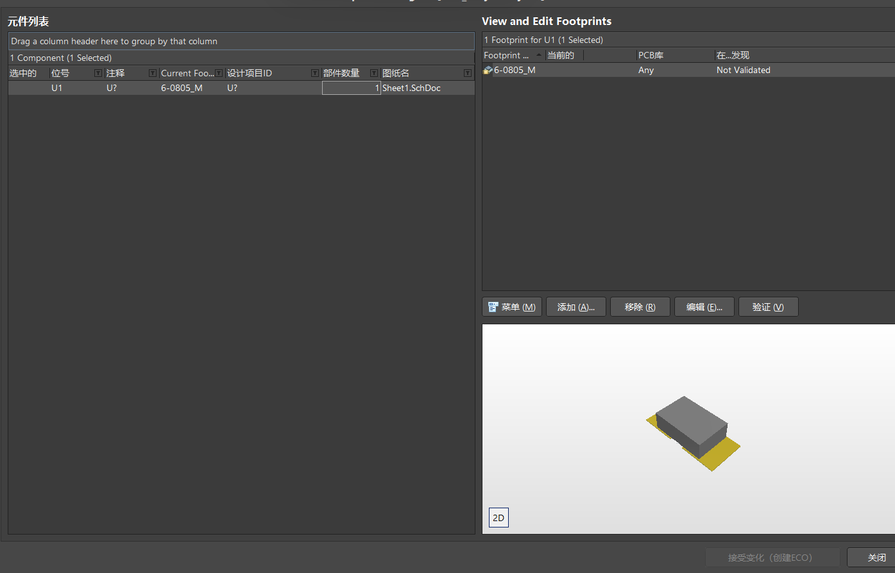

[Altium Design 4层板设计 11小时速成](https://www.bilibili.com/video/BV16t411N7RD?p=27&spm_id_from=pageDriver&vd_source=2f6e531d9d833ca7fdcd8c5bb99bd1bb)  

#第一课  
介绍他们自己的网站,以及一些学习资源  
PCB联盟网 : 一个专注于PCB的论坛   
里面包含一些常见的PCB问题等等

#第4课
# 绘制PCB工作流程

#第五课
# 管脚一定要完全一致
元件符号是元件在原理图上的表现形式，主要由元件边框、管脚（包括管脚序号和管脚名称）、元件名称及元件说明组成，通过放置的管脚来建立电气连接关系。元件符号中的管脚序号是和电子元件实物的管脚一一一对应的。<mark style="background: #FFB86CA6;">在创建元件的时候，图形不一定和实物完全一样，但是对于管脚序号和名称，一定要严格按照元件规格书中的说明一一对应好。</mark>

# 管脚末端的形状设置

# 设置栅格
视图 - > 栅格 -> 设置捕捉栅格  -> 改小栅格    
作用 : 可以让我们绘制的线不在栅格上  

#第七课
# 阵列式粘贴
选中元器件 -> ctrl+c -> 编辑 - > 阵列式粘贴  

主增量 : 这个可以设置管教是 1 2 3 4 5 6还是 1 3 5 7 9 ;  

#第八课   

# 栅格的作用

想画线,系统总是帮你自动对齐.这个时候你可以让栅格变小这个时候你就可以画到之前画不到的地方. 在画好之后建议把栅格再调整回去.  

#第九课   

# 使用已有原理图生成原理图库
设计 - > 生成原理图库  

#第11课  
器件的复制与对齐

# 使用方框将原理图模块化

注意要使用线而不是导线  
右击空白处 - > 放置 - > 绘图工具 - > 线 L  

#第12课
导线的绘制与netlabel的放置   

# Netlable
netlabel ; 选中导线 - > 右击 - > 放置 - > 网络标签

#第13课 
value值的核对

# 元器件的编号
一般是先连接电路,在电路连接完之后再标注电元器件的编号.    
工具 - 标注 - 原理图标注  
  

注意点 :   
1. 勾选需要标注的原理图页面
2. 先reset all - 更新更改列表

#第14课
封装的统一管理

# 统一改变许多元器件的封装

工具 - 封装管理器 - 选中要更改的元器件 - 编辑 - 选中封装 - 接受变更 - 执行变更

#第15课 
原理图的编译与检查  
工程 - 工程选项   

右击原理图 - 编译 - 错误显示出来  
右下角 - panel - 左击 - 选中 - messages

#第16课
#绘制PCB封装库技巧
    

# 焊盘的分类
  
就在表面的焊盘 (top layer)

  
multi layer 多个层

# 如何精确移动焊盘
选中焊盘 - 按下按键m - 选择通过xy平移 - 输入10mm - 精确移动10mm

# 镜像
选中焊盘 +  ctrl+c + 再选中一个点 - 就是渎职了一个焊盘相对于这个点的位置  
x y 镜像翻转  

#第17课  
常见IC类的封装  

#第18课  
利用ipc封装创建向快速创建封装  

工具 - IPC第一个 - 按照要求填写就行了,芯片手册上都有对应的ABCD等相对应的.

#第19课  
常用PCB封装的直接调用

#第20课     
3d模型的创建  
# 自己绘制3d元件
绘制 -放置3d元件体  

# 放入别人的3D模型
绘制 - 放入3d元件  

#第21课  
常见导入报错解决办法 #绿色错误

# PCB绿色报错
[AD导入PCB后模型出现绿色叉叉报错的解决办法\_ad中画pcb时有绿色包裹的圆叉叉-CSDN博客](https://blog.csdn.net/Curnane0_0/article/details/111963106)

  

意思是封装的间距是9.843mil，而我们设置的最小间距是10mil，所以报错了，只需更改一下最小间距即可

1. 设计 - 规则 - 改变clearance
2. 改为6mile
3. 删除错误部分,再重新导入

#第22课  
绿色报错   - 其实大部分就是见间距太小  
解决办法 :      
1. 改间距 就像上面
2. 设计规则检查中 只留下电气规则检查其他的检查都关掉.

  
先全部关闭,然后点击electrical后,开启所有的检查

#第23课
# 设置原点
e - o - s

# 裁剪板子形状

用线条在机械层绘制好线条,然后选中这几条线,然后d - s - d,就可以裁剪好板子的形状.

#第25课  
模块化布局