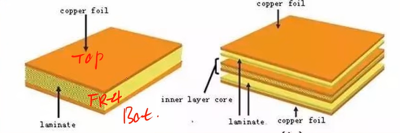
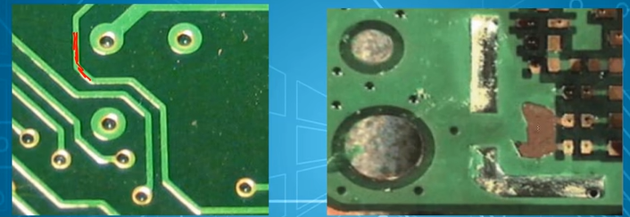
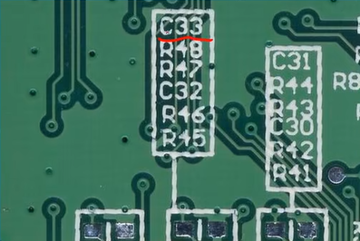
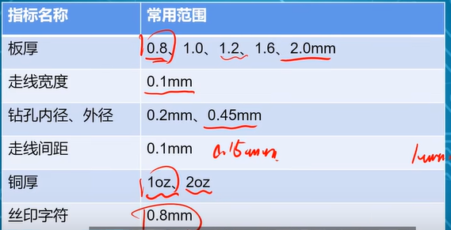
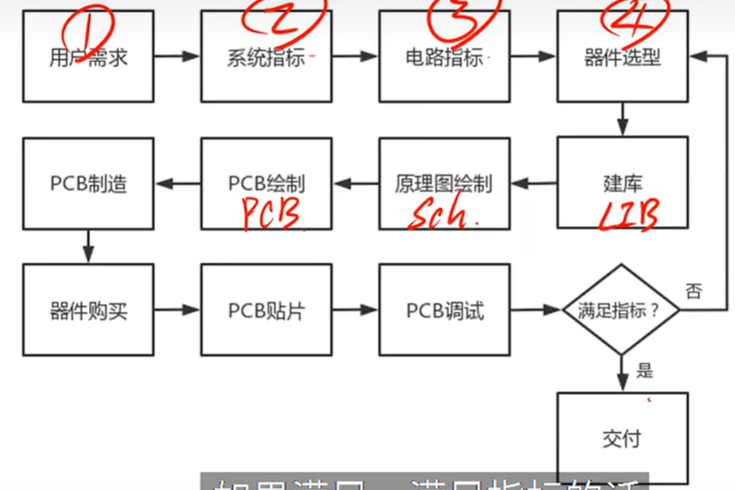

[PCB设计前知识扫盲](https://www.bilibili.com/video/BV1GU4y1N7Z6/?spm_id_from=333.337.search-card.all.click&vd_source=2f6e531d9d833ca7fdcd8c5bb99bd1bb)  
[Altium Design 4层板设计 11小时速成](https://www.bilibili.com/video/BV16t411N7RD?p=27&spm_id_from=pageDriver&vd_source=2f6e531d9d833ca7fdcd8c5bb99bd1bb)  

# 板层结构

上面 : 铜层  
中间 : FR-4 玻璃纤维  绝缘的
下面 : 铜层  

4层板就是两个两层板叠在一起,中间加了半预制片(也是绝缘的).

阻焊层 : 在铜板上覆盖上油漆 保护电路板防止氧化

  
这些丝印又叫做位号  

# 常见指标

一般走线间距与走线宽度是一致的  

# PCB设计基本流程

# 专业术语
Gerber 光绘文件  
沉铜 : 在孔洞的内部镀上铜