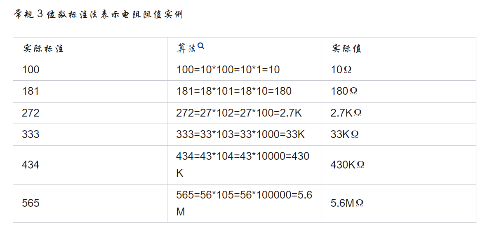
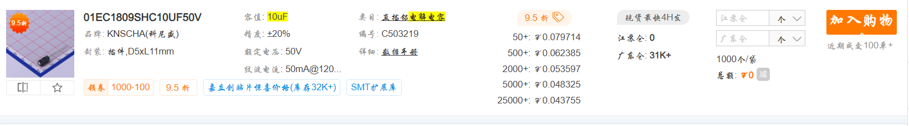
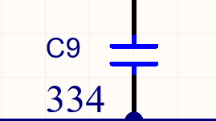
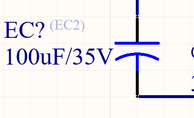

# 标识
贴片电阻怎么识别？识别方法有哪些？ - 捷配PCB的回答 - 知乎
https://www.zhihu.com/question/439345500/answer/2752091215

电容104是**0.1uF大小的电容**，也就是100000pF大小的电容。 计算方法是10乘以10的4次方的100000，单位是pF。    
104 = 100000 pf = 0.1uf
0.33uf = 334 = 330000   

334表示此电容容量为330000p（皮法）=0.33uf （微法）   
10uf = 10 000000 pf = 106

106=10x10^6pf=10000000pf=10000nf=10uf  
  
1uf=1000nf=1000pf  
  
pf是电容最小单位

   

# 电容
标识如上   
另外 :   
10uF属于大电容,需要用插件.称之为电解电容.   

  

- 注意Comment标注的东西不一样
- 另外符号也不一样,这个就表示大电容有时候.
且一般这种大的插件电容需要标注额定电压,有时候还需要把容差写上去.

## 总结
- 插件和贴片电容的符号不一样,也可以说是容量大的电容与容量晓得电容的符号不一样.   
- 且他们在comment的标注也不一样.小电容comment : =value;大电容是额定容量和电压