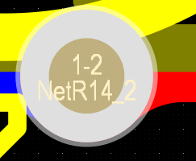
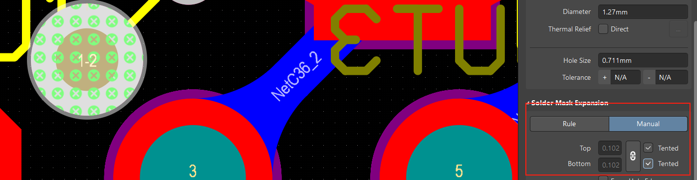

# 布线宽度关系
这些关系为：
地线>电源线>信号线，通常信号线的宽度为**0.2-0.3mm(8-12mil)**，最细的宽度为0.05-0.07mm(2-2.8mil)，电源线为1.2-2.5mm(48-100mil)

[PCB常用走线宽度与过孔](https://www.wpgdadatong.com.cn/blog/detail/70216)   
# 通孔焊盘与过孔
[PCB打样中焊盘和过孔的区别是什么 - 知乎](https://zhuanlan.zhihu.com/p/567311113)    

    

    
通孔焊盘想要变成过孔只要按照如下的操作即可完成:   
   

过孔的实物会比实际在PCB中标的孔径小   
通孔焊盘的孔径会比实际在PCB中标的小

在PCB设计中，过孔VIA和焊盘PAD都可以实现相似的功能。它们都能插入元件管脚，特别是对于直插(DIP)封装的的器件来说，几乎是一样的。

但是！在PCB制造中，它们的处理方法是不一样的。

1.      VIA的孔在设计中表明多少，钻孔就是多少。然后还要经历沉铜等工艺步骤，最后的实际孔径大概会比设计孔径小0.1mm。比如设定过孔0.5mm，实际完成后的孔径只有0.4mm。

2.      PAD的孔径在钻孔时会增加0.15mm，经历过沉铜工艺后，孔径比设计孔径稍大一点，约0.05mm。比如设计孔径0.5mm，钻孔会是0.65mm，完成后的孔径是0.55mm。

3.      VIA在某些默认的PCB工艺中会覆盖绿油，它可能会被绿油堵住，无法进行焊接。测试点也做不了。

4.      VIA的焊环最小宽度为0.15mm（通用工艺情况下），以便保证可以可靠沉铜电镀。

5.      PAD的焊环最小宽度为0.20mm（通用工艺情况下），以便保证焊盘的附着力量。

# 泪滴处理
[AD 泪滴处理](https://blog.csdn.net/qq_42108414/article/details/102965239)

# 如何导入别人的工程
如果只收到了别人的schdoc 与 pcbdoc应该如何导入.  
如果你只是创建了一个新的工程,然后添加了已有的schdoc与pcbdoc.  
这个时候如果你修改了原理图文件,再更新PCB的话是会出错误的.  
  
如这个DOCX文件.

你可以先生成PCB库,然后再去更新PCB板.  
- [ ] 然后所有的错误你就一路点过去然后执行变更
	- [ ] 当然这个需要改变,不一定

# 线宽与电流
通常宽1.0mm，铜厚1oz（0.035mm）的走线可通过约2A的电流