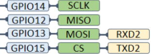

# 环境搭建
[3-1-2 为ESP8266-NodeMCU搭建Arduino IDE开发环境 – 太极创客](http://www.taichi-maker.com/homepage/esp8266-nodemcu-iot/iot-c/nodemcu-arduino-ide/)   
[Arduino库](http://www.taichi-maker.com/homepage/arduino-coding-index/)    
# 功能简单介绍
简单介绍一下 :

-   多个GPIO
-   支持硬件SPI协议
-   提供软件实现 串口 SPI IIC协议的第三方库
- 12 bit ADC


# ESP8266新手准备
明确一点 ESP8266并没有实际上的IIC通讯接口.他是通过软件实现的IIC通讯.    

    


[ESP8266接口详细介绍](assets/Pasted%20image%2020240106163323.png)    
[NodeMCU开发板引脚映射-腾讯云开发者社区-腾讯云](https://cloud.tencent.com/developer/article/1813149)   

网上买的测试板一般都是 NodeMCU     
Arduino编辑器中需要选择合适的器件,因为不同的器件会对应不同的头文件.选错器件就会导致引脚对应不上.

~~~c
digitalWrite(4,HIGH);//这个肯定是对的 这个是芯片引脚的定义GPIO4
digitalWrite(D4,HIGH);//这个在芯片信号选错后就是错的 这个是D4是厂商根据自己的板子信号写在库文件中的,板子选错就会导致库文件选错.
~~~

## 一般新手常犯的错误
1. 板子型号选错
这个就导致你按照网上的有些教程直接抄来的代码不能运行.因为i端口写错了.
解决办法: 找到你认为 你目前正在操作的端口,写一个高低电平转换的程序,用digitalRead函数把这个端口的电平状态读出来,用串口打印出来,看看端口有没有变化就能确定是否选对了板子乐.   
你认为下面的程序是控制哪个引脚那?    
#测试例程  

~~~c
void setup() {
  // put your setup code here, to run once:
  pinMode(4, INPUT);//右边第三个引脚
  Serial.begin(115200);

}

void loop() {
  // put your main code here, to run repeatedly:
  Serial.println(digitalRead(4));
  delay(1000);//1s
}
~~~

2. 引脚 Pin 一般设置默认是 输出模式 
所以在使用引脚时,一定要先在setup中设置一下引脚的模式.

## 烧录失败
ESP8266有几个引脚是烧录用的,在烧录的时候需要断掉这几个引脚的连接.
但是我现在还没弄清是哪几个引脚,现在的建议是烧录程序时先全部断开.    

    
应该是这四个引脚中的RXD2与TXD2是用来专门烧录程序的.    
这两个个引脚已经接入到数据线里面了,所以不能被占用.

## 烧录后程序没有运行
烧录程序后需要重启一下开发板.
1. 直接拔掉USB再插上
2. 板子上有一个RST按键,直接按下..效果同上.

## 如何给ESP8266板子供电
ESP8266有一个稳压器,理论上可以输入高达12V的电压  
___
## ESP8266烧录选项
[ESP8266烧录选项](assets/截图_20240106213251.png)      

___

# 软件串口
Software Serial 软件串口
他自己有串口库在Lib文件夹的EEPROM里
```c++
#include <SoftwareSerial.h>

SoftwareSerial mySerial(4, 0); // RX, TX
String  x = "1111111";
void setup() {
  // Open serial communications and wait for port to open:
  Serial.begin(9600);


  Serial.println("Goodnight moon!");

  // set the data rate for the SoftwareSerial port
  mySerial.begin(9600);
  mySerial.println("Hello, world?");
}

void loop() { // run over and over

  if (mySerial.available()) {
    mySerial.println(mySerial.readString());

  }

  delay(500);

}
```

# 通讯协议

## 串口通讯 硬件 软件

```c++
#include <SoftwareSerial.h>

SoftwareSerial mySerial(4, 0); // RX, TX
String  x = "1111111";
void setup() {
  // Open serial communications and wait for port to open:
  Serial.begin(9600);  //硬件串口开启


  Serial.println("Goodnight moon!");

  // set the data rate for the SoftwareSerial port
  mySerial.begin(9600);//软件串口开启
  mySerial.println("Hello, world?");
}

void loop() { // run over and over

  if (mySerial.available()) {
    mySerial.println(mySerial.readString());

  }

  delay(500);

}
```

## SPI通讯
### 硬件
[SPI硬件通讯](https://blog.csdn.net/solar_Lan/article/details/79249153)      
~~~c
/**********************************************************************
  程序名称/Pam name     : SPI主机通讯
  团队/Team                 : 太极创客团队 / Taichi-Maker (www.taichi-maker.com)
  作者/Author               : Dapenson
  日期/Date（YYYYMMDD）     : 2020/06/23
  程序目的/Purpose          :
  演示如何使用UNO(主)和UNO(从)之间进行SPI通讯
  -----------------------------------------------------------------------
  修订历史/Revision History
  日期/Date    作者/Author      参考号/Ref    修订说明/Revision Description
  -----------------------------------------------------------------------
  其它说明：
  本程序来源于以下链接,由Dapenson进行整理和注释,
  目的是为了让初学者更好的理解和学习相关内容

  http://suo.im/5Hd8cE
***********************************************************************/

#include <SPI.h>

void setup () {
  Serial.begin(9600); //初始化串口波特率
  digitalWrite(SS, HIGH); // 禁用从设备HIGH为禁用
  SPI.begin ();
  SPI.setClockDivider(SPI_CLOCK_DIV8);//设置SPI的时钟为八分之一
}

void loop () {
  digitalWrite(SS, LOW); //启用从设备
  // 发送测试的字符串

//  spiTest();
  digitalWrite(SS, HIGH); // 发送完毕后再次禁用从设备
  delay(200);
}


void spiTest()
{
  SPI.transfer (0x01);
  SPI.transfer (0x02);
  SPI.transfer (0x03);
  SPI.transfer (0x04);
}
~~~
### 软件SPI


## IIC软件通讯

