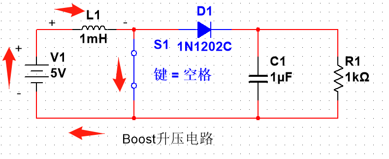
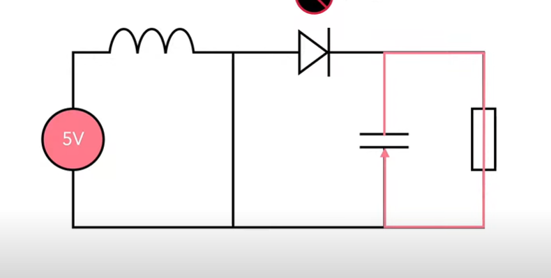
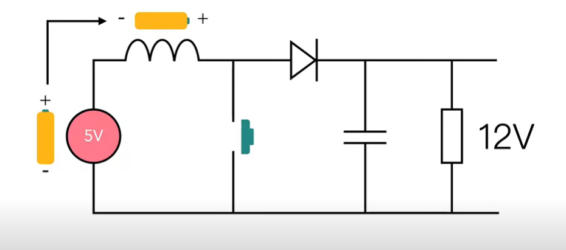
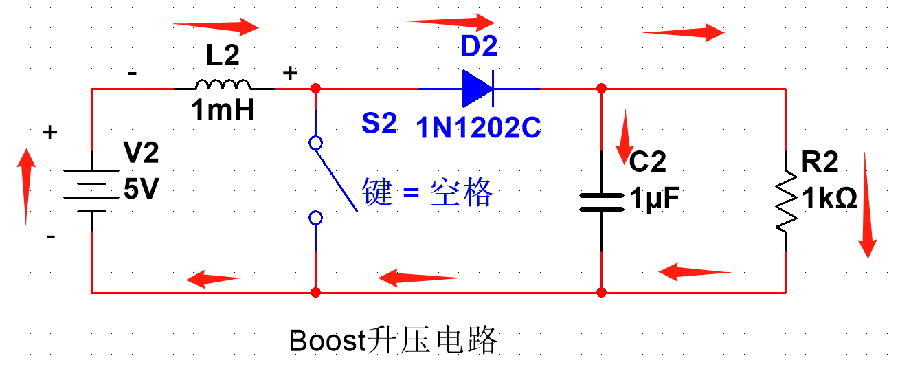
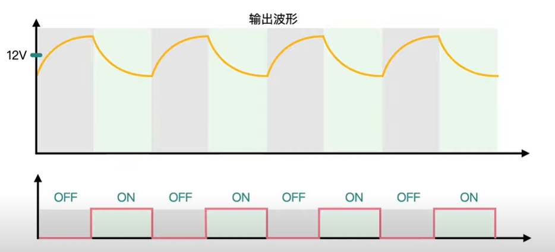
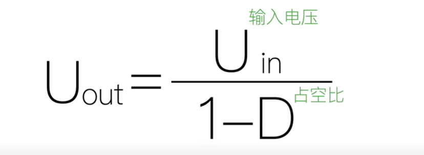

[怎么把5V电升到12V？开关电源BOOST升压原理 - YouTube](https://www.youtube.com/watch?v=prdcMFQ4Bvk)   

状态一  

  

     

由于负载被开关断路,导致电流突然增加.    
电感为了放置电流突然增加,产生与电池相反自感电动势. ,并且电感在此时开始储能.  
导致此时输出的电压肯定低于5V, 原本电容应该为电感充电,但是由于二极管的存在,电容无法为电感充电.   

  

开关闭合时 :   
负载的电压由电容提供,虽然电容是能提供短时间的电源,但是我们只要提高开关通断的速度就可以了.

状态二    

  

     

当开关开路 :    
电流突然变小,因为负载不再被短路.那么电感又产生了自感电动势来阻止电流变小,电感就和电容一起给负载供电.  
电流+电感+电池的供电 > 电池的供电   

最后的曲线应该是这样的 :  

#二极管的作用 
但是由于二极管的存在,电容无法为电感充电.   
不让电容给电感供电  

# 输出电压与占空比的关系
   

电压虽然是升上去了但是电流肯定是会下降的.    
因为功率是不能升上去的.    