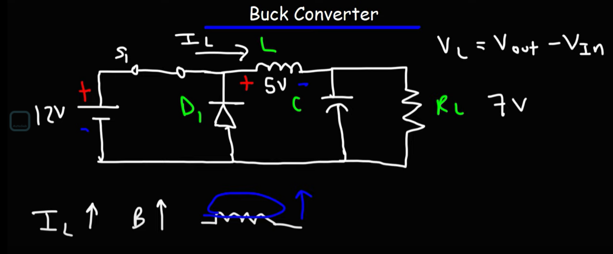
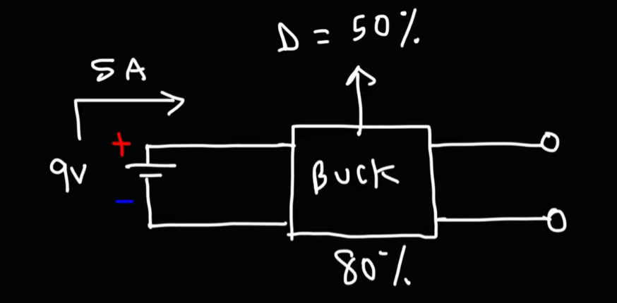

[Buck Converter Analysis](https://www.youtube.com/watch?v=rfChSvb8FX0)

不同于其他的电路 zenner doide;或者linear regulator.使用dissipate heat的方式来降低电压,buck电路使用增大电流的方式来降低电压.  
___
Buck 降压电路 :  
通过增加电流来降低电压.    
Boost 升压电路 :   
通过减小电流来增大电压  

# Buck电路 降压

#二极管的作用
防止电荣给电感充电.所以你看无论什么是升压还是降压电路,都是把

电感两端的电压是 : $V_L = V_{out} - V_{In}$ 请注意这个和电源的电动势是*相反的*.  

**如何升压** :  
在开关断开后 : 如果电感器两端的电压比电容器两端的高那么电感器就给电容器充电  
如果电感器和电容器两端的电压一样高那么电感就和电容一起给 电阻供电.

#Buck电路是如何增加电流实现降压的  
**因此在开关闭合时,电阻接受来自电池的电流.**    
在开关未闭合时,电阻接受来自电感的电流.  
实际上 不断开合开关 : 来自电池的电流 + 来自电感器的电流 > 仅来自电感器的电流的!  
这就是buck降压电路通过增大电流来实现降压的原理.

我们可以说在刚闭合开关的一瞬间,电感分走了一部分电源电压(电感阻碍电流变化,刚闭合开关时,电流的变化是非常大的$\frac{di}{dt}$非常大,因此电感的阻值也可以看成非常大,因此分走了很多的电压[按照分压原理],虽然这个分压的过程是持续很短的时间的.)  

自己的理解 :   
在闭合开关的一瞬间 : 电感两端是会有电压的(因为电电感是放置电流突变,而电流突然增减也算是电流突变).因此在开关闭合的一瞬间,电阻两端的电压减小了,他并不是原定的12V,而是7V.   

通过这样不断地开闭开关,让电感电容始终处于充放电的状态,那么就可以实现降压.  

# Buck降压电路的效率问题
  
假设这个Buck降压电路的 :  
1. 占空比是50% 就是可以推算出实际上输出的电压幅值,为下文的Vout
2. 效率是80% 这个是指整个Buck电路的功率转换效率
3. 输入电压是9V
4. 能够提供的最大电流是5A  
计算公式如下图表示 :    
则 Pin = UI = 9 × 5 = 45W  
Vout = Vin × Duty_Cycle = 9 × 0.5 = 4.5V  
Pout  = Pin × 0.8 = 36W  
Iout = Pout / Vout = 36 / 4.5 = 8A  
*由此可以看出Buck降压电路是通过提升了电流来降低了电压.*  
___
明确一点,Vout = Vin × Duty_Cycle ; (记住这个是电压,不是功率   
Buck降压电路的转换效率;和他的电压转换是分开的.   

# 总结
#Buck电路是如何增加电流实现降压的  
**因此在开关闭合时,电阻接受来自电池的电流.**    
在开关未闭合时,电阻接受来自电感的电流.  
实际上 不断开合开关 : 来自电池的电流 + 来自电感器的电流 > 仅来自电感器的电流的!  
这就是buck降压电路通过增大电流来实现降压的原理.

