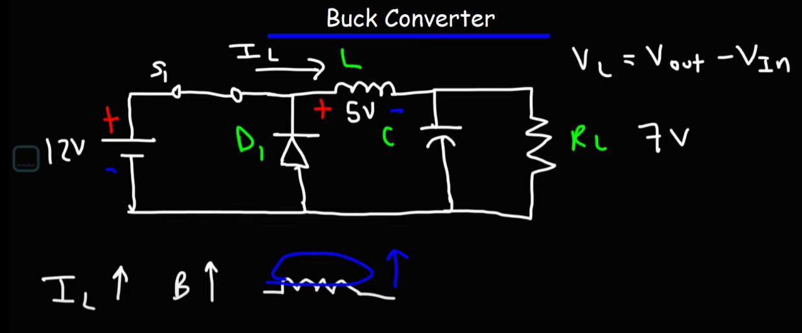

Buck 降压电路 :  
通过增加电流来降低电压.  
Boost 升压电路 :   
通过减小电流来增大电压  

# Buck电路 降压

自己的理解 :   
在闭合开关的一瞬间 : 电感两端是会有电压的(因为电电感是放置电流突变,而电流突然增减也算是电流突变).因此在开关闭合的一瞬间,电阻两端的电压减小了,他并不是原定的12V,而是7V.   

通过这样不断地开闭开关,让电感电容始终处于充放电的状态,那么就可以实现降压.  

# Buck降压电路的效率问题
  
假设这个Buck降压电路的 :  
1. 占空比是50%
2. 效率是80%
3. 输入电压是9V
4. 能够提供的最大电流是5A
则 Pin = UI = 9 × 5 = 45W  
Vout = Vin × Duty_Cycle = 9 × 0.5 = 4.5V
Pout  = Pin × 0.8 = 36W  
Iout = Pout / Vout = 36 / 4.5 = 8A  
*由此可以看出Buck降压电路是通过提升了电流来降低了电压.*  
___  
明确一点,Vout = Vin × Duty_Cycle ; (记住这个是电压,不是功率).
Buck降压电路的转换效率;和他的电压转换是分开的.
