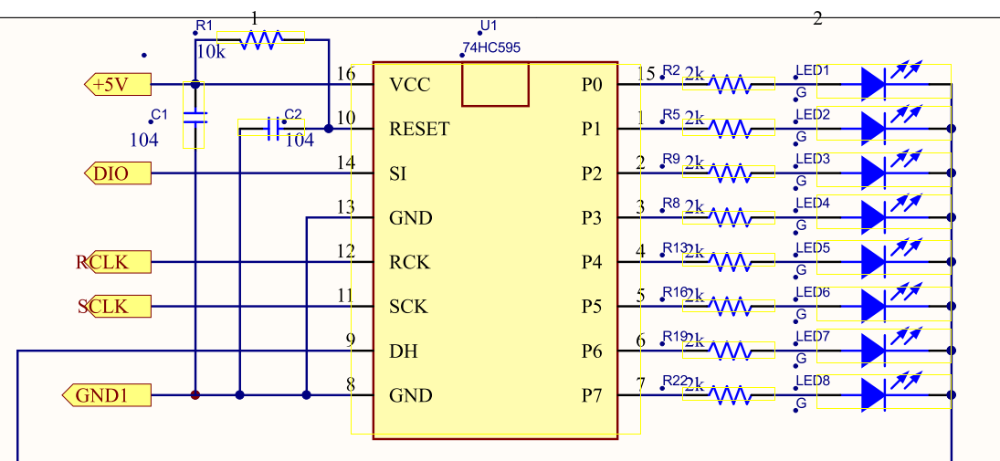

- 16个按键是通过AD检测电压来实现的
- 通过一个DC-DC的转换芯片把29V转到5V
- 语音模块是

霍尔信号其实就是方波信号,这么叫的原因是因为 :  
以前测量电机的行程需要霍尔传感器,霍尔传感器的输出就是方波信号. 所以即使是使用电流采样的方波信号也将只习惯性地称之为方波信号.

#这里要重新看
两个霍尔传感器产生两个方波信号,霍尔传感器放在不同的角度产生的方波会不同,相位产生偏差.
单片机通过采样高电平变为低电平的次数来判断电机的行程.  相位决定方向,次数决定行程. 相位决定次数是增加还是减小[霍尔值],霍尔值的大小就代表行程.  

___   
我们的 :    直流有刷电机
由于电机的特性,它会产生正弦波,用采样电阻采样这个正弦波,用差分放大电路放大电阻两端的电压,再经过放大电路放大一次.得到输出的方波信号.  
计数方波信号由高电平变为低电平的次数为霍尔值.  
我们的芯片是R1H 1 R1L 0电机酒伸长,反之缩小由这个来判断累计的高低跳变是加在霍尔值上还是减在霍尔值上.   

___  

595的扩展芯片级联在一起 用三个IO控制16栈灯