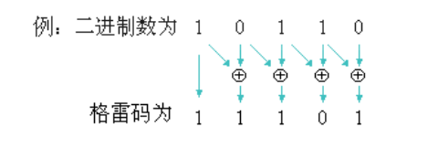
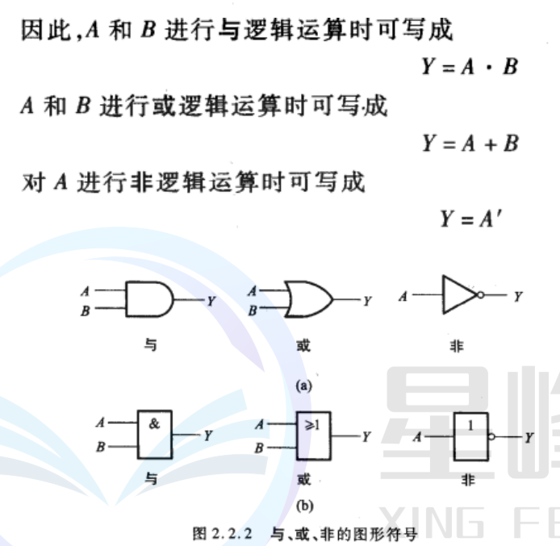
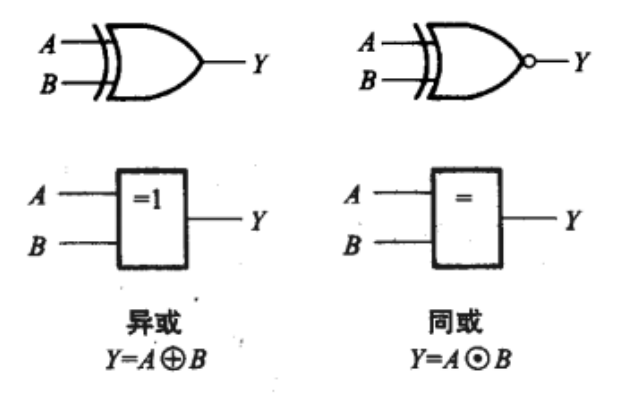
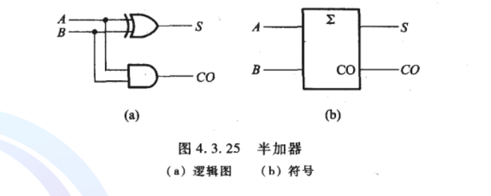
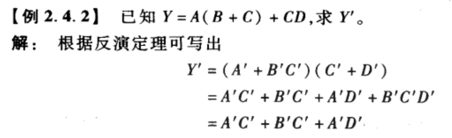
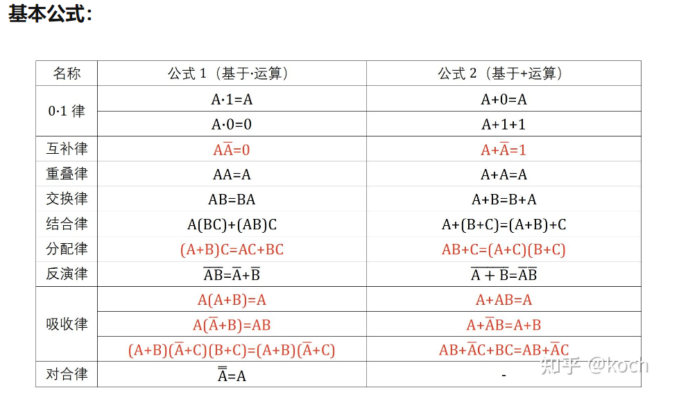
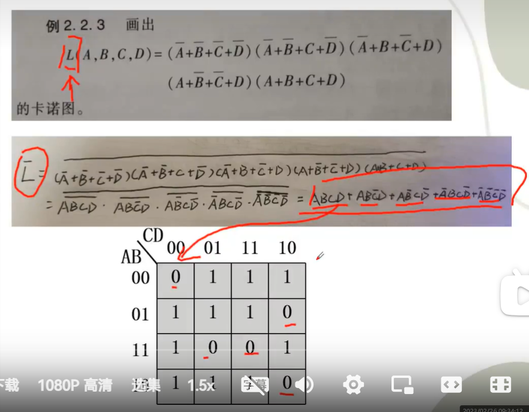
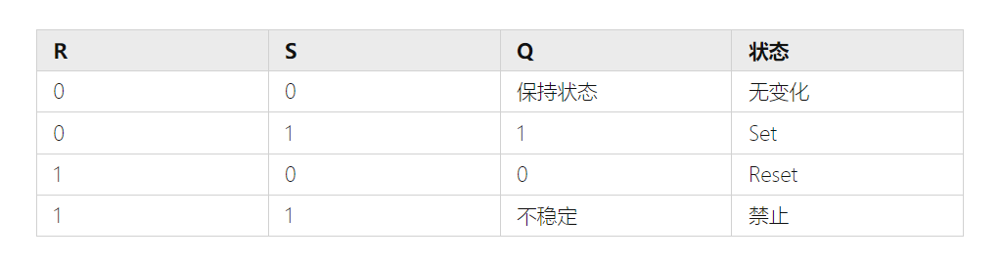

[数电](assets/数电经典面试题121问.pdf)

# 简述常见码字之间的转换
10进制转换为别的进制时, 10/[对应进制],然后反向排列余数

例如: 13 -> 1101    1011 -> 1101

[ASCII码表](assets/Pasted%20image%2020231024151928.png)   65 A 97 a

# 数字量 数字信号 数字电路
数字量 是指以数字形式表示的、离散的物理量或信息,他们在时间和数值上是离散的.

把表示数字量的信号称为数字信号

工作在数字信号下的电路称之为数字电路

# 原码、反码、补码之间的关系以及补码的运算

- 第一位为符号位 0 正 1 负
- 正数 原码 = 反码 = 补码
- 负数 反码 = 原码全部取反 ; 补码等于 反码+1
二进制没有减法,减法视作负数,需要转为反码然后相加.,不是转一个为反码,是所有的负数都要转为反码.

# 格雷码

1. 格雷码没有大小之分,没有权重
2. 格雷码相邻位只有一位不同
3. 格雷码具有反射性与循环特性,绝对编码方式是指每个码字都有唯一的二进制表示
4. 格雷码的生成  保留第一位 第二位与随后的 由上一位与本位异或生成

# 各种编码方式

## 余三码
其实就是模三
14 除以 3，得到商 4，余数 2。这表示数字 14 可以用余三码表示为 42

## 奇偶校验码
奇校验
数据1个数为偶数 则奇校验位为 1 ; 数据为奇数 则奇校验为为0
偶校验 反之

# 逻辑门l

# 半加器
半加器由一个异或门与一个与门组成

$$
S = A^`B + AB^` = A {\oplus} B 
$$
$$CO = AB$$

# 反演定理
逻辑式 Y的 所有逻辑全部反一边

# 最小项 最大项的性质

## 最小项

n个变量的逻辑乘 . 每个变量以原变量 或者 变量取反的形式只出现一次.
ABC就是一个最小项  $ABC^`$  也算是一个

性质:
- n个变量有$2^n$个最小项
- 相邻最小项之和可以消去一个因子
- 所有最小项只有一个为 1,其他的都是0,全部和为1

## 最大项
n个变量的逻辑或

性质 : 
 - 只有一个最小项为1 其他全为 0
 - 只有一个为0,其他全是1

# 数字电路的基本公式

# 卡诺图

# 触发器

## SR触发器

# 触发方式
电平触发

输入电平保持一段时间,触发状态的改变

脉冲触发

脉冲的上升沿或者下降沿,触发状态的改变

边沿触发

只在脉冲的上升或者下降沿触发

