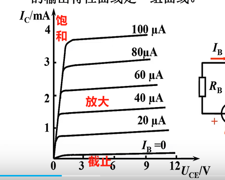
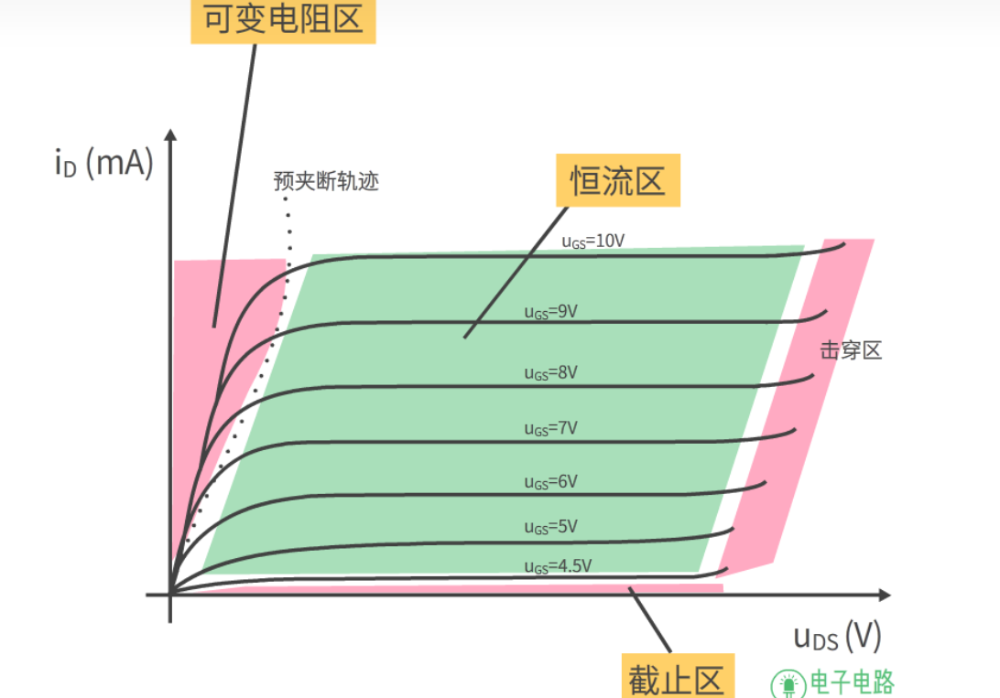

三极管 : 双极性晶体管
场效应管: 单极性晶体管

# 三极管的导通

对于三极管的开关特性分析，主要是看基极与发射极之间的电压情况。

PNP，只要e极电压比b高0.7V以上，e、c之间就可以导通；

NPN，只要b极电压比e高0.7V以上,e、c之间就可以导通。

# 三极管的三种工作状态
  
三极管有三种主要的工作状态，它们是：

1.  放大状态：在这种状态下，三极管用作信号放大器。输入信号会引起输出信号的放大，通常用于放大电路中。
    
2.  截止状态（截止区）：当三极管的基极电压低于某个特定阈值时，它处于截止状态，不导通电流。这种状态通常用于开关应用，其中三极管用于控制电流的流动。
    
3.  饱和状态（饱和区）：当三极管的基极电压高于某个特定阈值时，它处于饱和状态，允许最大电流通过。饱和状态通常用于开关应用，其中三极管用于允许最大电流流动。
    

这三种状态是三极管的基本工作状态，它们用于不同类型的电路和应用中，以实现放大、开关和控制电流。

# [MOS管](https://blog.csdn.net/weixin_42328389/article/details/123922558)

## MOS管如何导通

**截止区**：当满足Ugs<Ugs(th)，MOS管进入截止区。
截止区在输出特性最下面靠近横坐标的部分，表示MOS管不能导电，处在截止状态。截止区也叫夹断区，在该区时沟道全部夹断，电流Id为0，管子不工作。

  
**恒流区**：当满足Ugs≥Ugs(th)，且Uds≥Ugs-Ugs(th)，MOS管进入恒流区。

#如何画场效应管
- S和栅极连接在一起
- MOS管的图标与三极管的正好相反

极性
G 栅极 D 漏极 S 源极

中间NMOS 

## MOS管工作原理
[Mos管的工作原理 01](https://www.bilibili.com/video/BV1344y167qm/?spm_id_from=333.337.search-card.all.click&vd_source=2f6e531d9d833ca7fdcd8c5bb99bd1bb)
N型半导体场效应管 5价磷 多一个自由电子
P型半导体场效应管 3价硼 缺一个电子,用空穴代替,显示正电

重点是要与空穴复合,这样才能导电.

正电接到栅极上,就把空穴排斥走了,电子被吸引过来就形成了N沟道.全是电子就可以移动了就形成了电流.

## CMOS