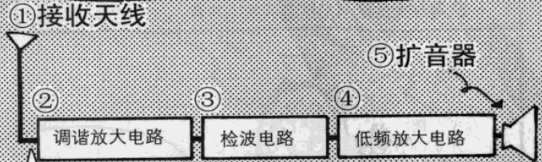
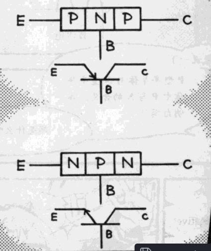

___
电子电路分类  
1. 放大电路
2. 振荡电路
3. 调制电路
4. 检波电路
5. 滤波器
6. 运算放大器
7. 逻辑电路
8. 电源电路

振荡电路 :   
就是能够在没有任何
输入信号*的地方产生
交流信号，应用在手
提电话等方面。   
例如: 形成正弦波   

逻辑电路的特点 :  
1. 计算加法的电路
2. 计算乘法的电路
3. 记忆数字和文字的电路

___
# 双极晶体管

导通三极管的条件 : 
**在发射极与基极之间加正向偏压,在基极与集电极之间加反向偏压.**