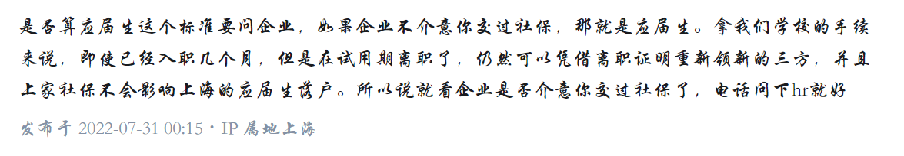

[求问22届应届毕业生，如果已经入职了一家公司正在实习期，还可以参加国企的校招吗？算应届毕业生吗？ - 知乎](https://www.zhihu.com/question/545825153/answer/2601104033)

您好 : 
很抱歉打扰您,我想向您询问一下certification letter的进度.

对于因为我的事情对您和您的同事造成的麻烦我深感抱歉.但是因为这件事关系到我最近的工作问题,所以我希望学校能尽量帮我处理这些问题.

圣诞节快到到了,祝您和您的同事有一个愉快的圣诞!