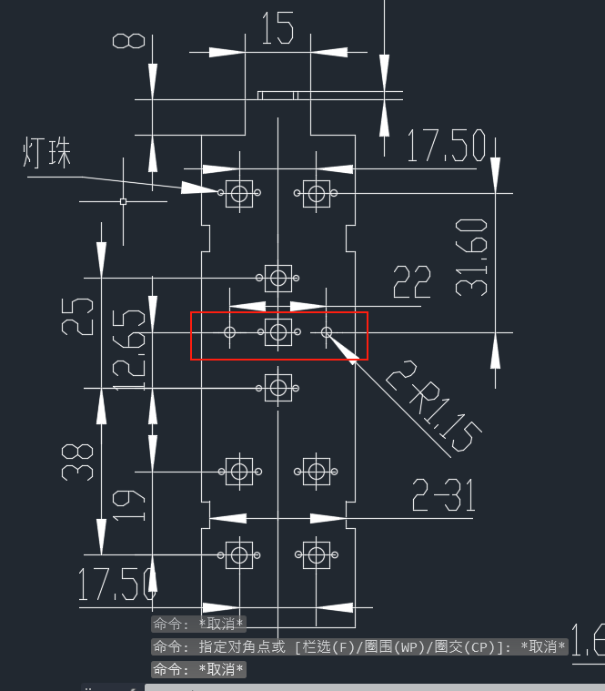
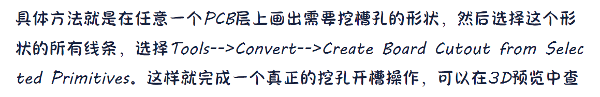

(8.25,13.125)   
(8.25,4.375)    
(17.75,13.125)  
(17.75,4.325)  
(27.25,8.75)
(33.575,8.75)  
(39.75.8.75)  
(49.375,13.125)  
(49.375,4.375)

(16.5, 26.25)
(16.5, 8.75)
(35.5, 26.25)
(35.5, 8.65)
(54.5, 17.5)
(67.15, 17.5)
(79.5, 17.5)
(98.75, 26.25)
(98.75, 8.75)  

   

只有这个要灯珠吗? 别的不要灯珠吗?   

[Python包发布指南 - 知乎](https://zhuanlan.zhihu.com/p/115302375)  

(33.575,3.25)  
(33.575,14.25)  

(67.15, 6.5)  
(67.15, 28.5)  
1.15

  