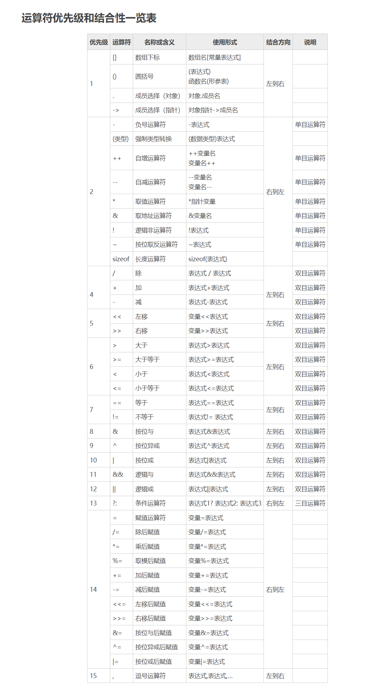
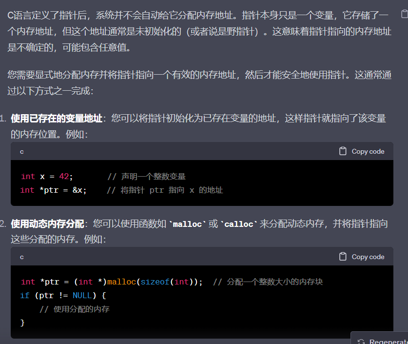

[100道C语言面试题](https://blog.csdn.net/qwe5959798/article/details/104511822)
[C语言入门书籍推荐，小白自学经典（免费下载）](http://c.biancheng.net/view/1674.html)

# 运算符的优先级



# 什么是函数重入


# 字符串字面值
字符串字面值是指在C语言中用*双引号括起来的字符串*。它们是在程序编译时创建的，存储在*只读内存中*，因此被视为常量。字符串字面值是不可变的，这意味着一旦创建，就不能直接修改它们的内容。例如：

```c
const char *str = "Hello, World!";
```


# 野指针

```c
int *ptr  = 10;//是错的

/*

因为ptr只是存储内存地址的变量,系统并不会自动给他分配内存地址,也就是说在未初始画ptr的值的时候,ptr的内存地址变量是随机的,这个时候改变*ptr的值就会随机改变一个内存地址的值导致系统崩溃


*/
```




# volatile
关键字"volatile"用于编程中，通常用于声明变量，它具有以下含义：

1.  告诉编译器不要对变量进行优化：当一个变量被声明为"volatile"时，编译器将不会对该变量的读取和写入操作进行优化，以确保对该变量的访问是按照程序的要求顺序执行的。这对于多线程编程和嵌入式系统编程非常重要，因为编译器通常会对变量的读写顺序进行优化，这可能会导致意外的行为。
    
2.  强制从内存读取和写入：声明为"volatile"的变量将始终从内存中读取和写入，而不会使用寄存器来进行缓存。这可以确保在多线程环境中，一个线程对该变量的修改立即对其他线程可见。
# 头文件
1.  `<filename.h>`：
    
    -   编译器将在标准系统目录（或编译器配置的目录）中搜索文件，然后在当前目录之外的系统目录中查找。
    -   示例：`#include <stdio.h>`
2.  `"filename.h"`：
    
    -   通常用于包含自定义头文件或项目内的头文件。
    -   编译器首先在当前源代码文件的目录中搜索文件，如果找不到，它会继续在系统目录中查找。
    -   示例：`#include "myheader.h"`

# static关键字
___
静态变量：

-   在函数内部声明的静态变量会保留其值，即使函数退出作用域，该变量的值也会被保留。
-   静态变量在程序生命周期内只初始化一次，通常用于在多次函数调用之间保持状态信息。

___
静态函数：

-   在C中，`static` 用于修饰函数，表示该函数只在当前文件中可见，即具有文件作用域。
-   静态函数不能被其他文件中的函数调用，这有助于封装和隐藏模块的实现细节。
-   静态函数的使用可以减少全局命名空间的污染，防止与其他文件中的函数发生命名冲突。
___
`static` 还可以用于定义静态全局变量（只在当前文件内可见）以及静态成员变量和静态成员函数（在C++类中）。这些用途有助于改进代码的可维护性、封装性和安全性。
___